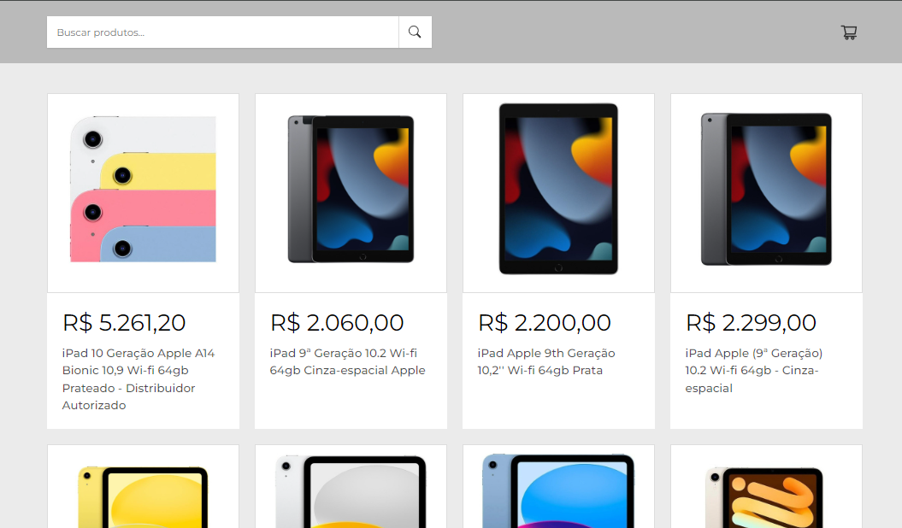
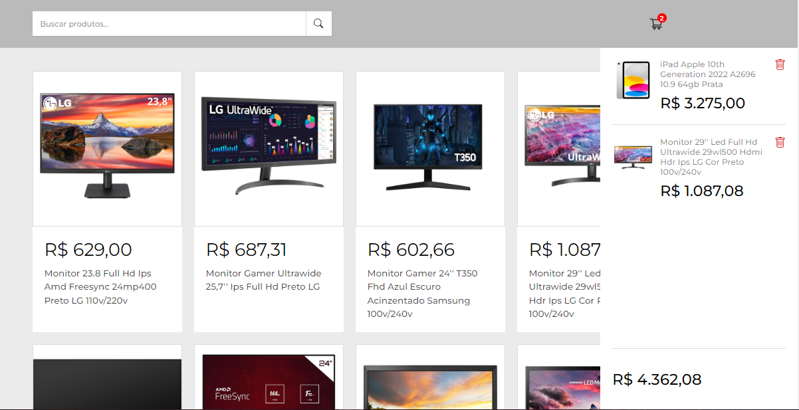

<h1 align="center"> 🛒shopCart </h1>

### 💻 Projeto

shopCart trata-se de um projeto de carrinho de compras, que permite listar produtos na tela, consumindo a API do Mercado Livre.

  <a href="#-projeto">Projeto</a>&nbsp;&nbsp;&nbsp;|&nbsp;&nbsp;&nbsp;
  <a href="#-tecnologias">Tecnologias</a>&nbsp;&nbsp;&nbsp;|&nbsp;&nbsp;&nbsp;
  <a href="#-tecnologias">Funcionalidades</a>

 

  

   
   

  

## 🚀 Tecnologias

Esse projeto foi desenvolvido com as seguintes tecnologias:

-   ReactJS
-   API
-   Git e Github

## 🔧 Funcionalidades

-   Listagem de produtos através da API do Mercado Livre
-   Busca de produtos, com base nas palavras-chaves
-   Adicionar produtos ao carrinho de compras
-   Remoção de produtos do carrinho de compras

## :memo: Licença

Esse projeto está sob a licença MIT.
